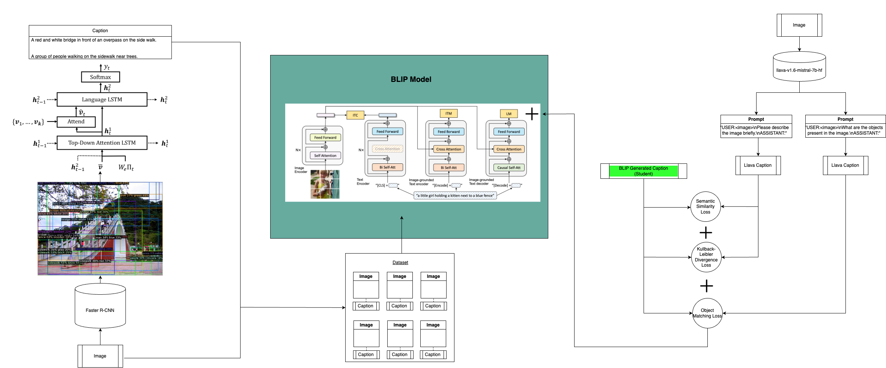
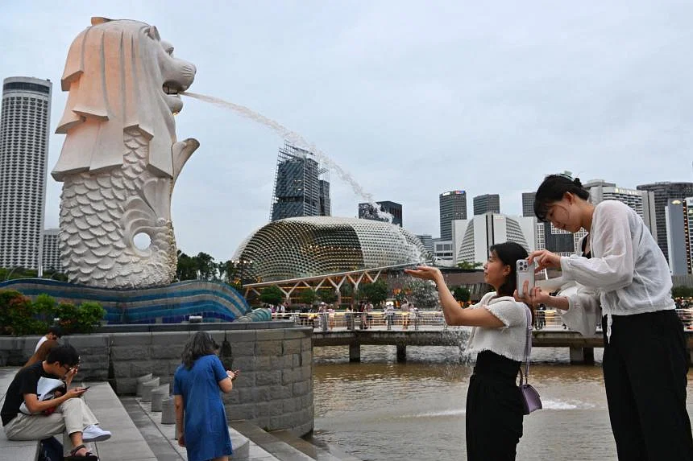

# Image Captioning with Novel Concepts

## Abstract

This project aims to develop an image-captioning model that can generalize to novel concepts not previously aligned in the model's image and text modalities. The approach uses bottom-up attention from airsplay/py-bottom-up-attention to extract objects and attributes from images, capturing both familiar and novel concepts. Following this, top-down attention from poojahira/image-captioning-bottom-up-top-down is employed to generate preliminary captions that integrate these newly discovered concepts.

While these preliminary captions may be weak and unstructured, they serve as a basis for fine-tuning a more robust foundational vision-language model, the BLIP model from salesforce/BLIP. This fine-tuning enhances the BLIP model's ability to generate captions that incorporate novel concepts. However, since the BLIP model is fine-tuned on these initial, less structured captions, its output is suboptimal. To address this, we perform distillation, with or without an adapter, to further refine the BLIP model's output. 

The distillation process employs Kullbeck-Liebler divergence loss to align the student's next-token probability distributions with those of the teacher model, llava-1.6-mistral-7b-hf. Additionally, a semantic matching loss is implemented to ensure that captions generated by the student model (BLIP) maintain semantic similarity with those of the teacher model. An object matching loss is applied to accurately represent objects in the captions, with an F1 score calculated to prevent hallucination of new objects and ensure grounding. During distillation, Kullback-Leibler divergence loss is combined with semantic matching loss, object matching loss, and the original BLIP model's language modeling loss. This combination guides the model to produce high-quality captions similar to those generated by llava, while retaining novel concepts.



*Figure 1: This diagram illustrates the overall framework for training the image-captioning model. On the left we have the bottom-up and top-down mechanism for generating preliminary captions. In the middle, we use our dataset of image paired with the preliminary captions to finetune BLIP. On the right, distillation is performed using the teacher model, leveraging the various implemented losses to enhance caption quality and model performance.*


## Repository Structure

- **BLIP**: Contains the Bootstrapped Language-Image Pre-training model and related scripts.
- **image-captioning-bottom-up-top-down**: Implements the bottom-up and top-down attention mechanism for enhanced caption generation.
- **py-bottom-up-attention**: Includes scripts and environments for feature extraction using a bottom-up attention approach.
- **shared_data**: Directory for storing shared datasets and extracted features.
- **experiment_results**: Contains experimental results demonstrating proof of concept.


## Results



*Figure 2: An image of the Merlion in Singapore used to test the BLIP model's ability to recognize novel concepts.*

Various experiments were conducted to evaluate the impact of distillation with and without an adapter on model performance. The results from these experiments, as well as the effects of fine-tuning and distillation, are presented.

To assess the model's capability to understand novel concepts, I tested it with an image of the Merlion, a well-known landmark in Singapore. Initially, the default BLIP image-captioning model was unable to accurately identify the Merlion due to the lack of alignment between its image and text modalities. Before fine-tuning and distillation, the model produced the caption: 
`"a man and a woman standing in front of a statue of a fish and a man pointing at it."` This output failed to recognize the 'Merlion' and inaccurately described the scene, mistaking the woman for a man and incorrectly suggesting someone was pointing at the statue.

After applying the fine-tuning and distillation framework with BLIP, the model successfully captioned the image as: `"a couple of people are standing in front of some water and there is a Merlion.**"` The model correctly identified the Merlion and avoided previous errors. However, further improvements can be made to generate even more detailed and accurate captions.

In the `experiment_results` folder, I have included 30 challenging images of the Merlion in various forms such as stamps and paintings. The model was able to caption most clear pictures of the merlion in different forms and settings correctly. This folder also contains captions for images that do not feature the Merlion, demonstrating that the model's performance remains consistent and that the concept of the Merlino does not appear when it is not in the image. Additionally, I tested images where the Merlion was replaced with random white shapes. The model did not predict the presence of a Merlion, indicating that it does not simply associate white shapes of the Merlion's size with the concept of the Merlion, even when the background is still set in Singapore and the shape occupies the Merlion's original position.


## Setup Instructions

### Step 1: Setting Up `py-bottom-up-attention`

1. **Download Flickr30K Dataset**:  
   Download the Flickr30K dataset and place it in the `shared_data` directory. Ensure the data is organized according to the dataset's requirements.

2. **Activate the Conda Environment**:  
   Navigate to the `py-bottom-up-attention` directory and activate the Conda environment:

   ```bash
   cd py-bottom-up-attention
   conda env create -f bottom_up_features_env.yml
   conda activate bottom_up_features
   ```
3. **Install Detectron2**:  
   Follow the setup instructions provided in the bottom-up feature repository to install Detectron2. Ensure you have the required dependencies and configurations for your system.

4. **Run Feature Extraction**:  
   To extract features, use the following scripts depending on your CPU configuration. The extracted features will be saved as a `.npy` file in the `shared_data` directory:

   - For systems with multiple CPU cores, run:

     ```bash
     python feature_extraction_with_attributes_parallel.py
     ```

   - For single-core systems, run:

     ```bash
     python feature_extraction_with_attributes.py
     ```

### Step 2: Preliminary Captioning

1. **Switch to the Image-Captioning Repository**:  
   Navigate to the `image-captioning-bottom-up-top-down` directory and follow the instructions in the README.

2. **Activate the Conda Environment**:  
   Activate the environment for top-down captioning:

   ```bash
   conda env create -f top_down_captioning_env.yml
   conda activate top_down_captioning
   ```

3. **Run Preliminary Captioning**:
   Generate preliminary captions from the bottom-up features extracted in Step 1:

   ```bash
   python preliminary_captioning_verbose.py
   ```

### Step 3: Fine-tuning and Distillation with BLIP

1. **Configure BLIP Model**:
   Navigate to the BLIP directory and set up the BLIP model with the instructions in the README.

2. **Activate the Conda Environment**:
   Activate the environment for BLIP:

   ```bash
   conda env create -f blip_environment.yml
   conda activate blip
   ```

3. **Fine-tune the BLIP Model**:
   Use the preliminary captions from Step 2 to fine-tune the BLIP model:

   ```bash
   python finetune_caption_custom.py
   ```

4. **Perform Distillation**:
   Distill the fine-tuned weights using one of the following scripts, depending on your preference for using an adapter:

   - With adapter and freezing weights:

   ```bash
   python distil_with_adapter.py
   ```
   - Without adapter and without freezing weights:

   ```bash
   python distil_without_adapter.py
   ```

5. **Evaluate Captions**:
   Evaluate the generated captions using Bleu4 and CIDEr scores:

   ```bash
   python analyse.py
   ```

   To see captions generated by LLAVA for the same set of images, run:

   ```bash
   python analyse_llava.py
   ```

   The output will be stored in the output folder within the BLIP directory.

## Goals and Future Work

The ultimate goal of this project is to enable image-captioning models to dynamically learn and adapt to new and unseen concepts without relying on manually annotated captions for fine-tuning. This automated approach is more efficient and flexible, allowing for the generation of synthetic captions for various downstream tasks without the need for new manual captions for each task.

Future work will focus on replacing the current Faster R-CNN object detector with a more powerful detector capable of recognizing novel concepts. Additionally, we aim to develop more specific evaluation metrics beyond Bleu4 and CIDEr to better assess the quality of captions that deviate from the rigid structure of human-annotated captions in Flickr30k. Enhancing the adapter to perform distillation while freezing the image encoder and text decoder will be explored to preserve the model's original captioning capabilities. Furthermore, this framework can be used to gain insights into pre-training, fine-tuning, and performing distillation for larger multimodal LLMs.
